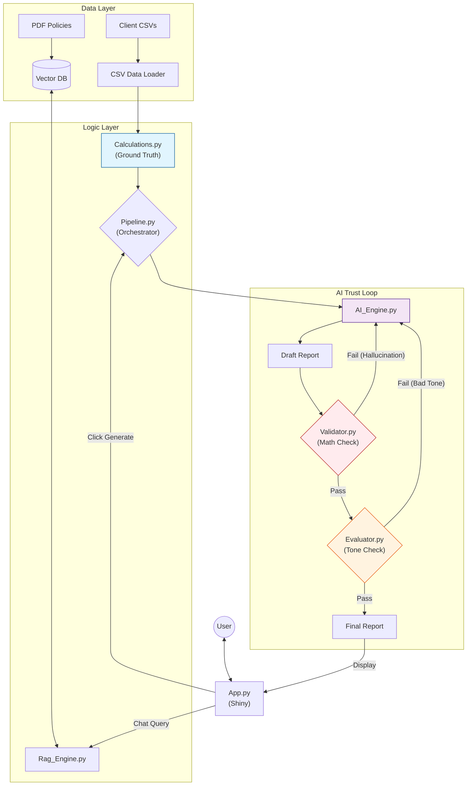

# Enterprise Credit Risk Reporting Engine (V3)

A robust, production-ready AI application for Credit Risk Model Validation. This system integrates real data ingestion, a "Guardrails & Evaluation" pipeline, and a RAG-based regulatory assistant to produce trustworthy, compliance-ready reports.

## Visual Architecture



## The "Trust Loop" Explained

Unlike standard GenAI tools, this engine does not trust the first draft.
1.  **Generation**: The AI writes a report based on the calculated statistics.
2.  **Validator (Guardrails)**: A deterministic code layer checks for:
    *   **Safety**: No PII leakage.
    *   **Consistency**: Did the AI say "AUC is 0.90" when the data says 0.85? If so, it fails.
3.  **Evaluator (LLM-as-a-Judge)**: A second AI pass grades the report for professional tone, faithfulness, and relevance.
4.  **Self-Correction**: If any check fails, the error is fed back to the AI, which generates a corrected draft (up to 2 retries).

## Features List

-   **Real Data Ingestion**: Loads client CSVs (`auc_data.csv`, `calibration_data.csv`, `score_data.csv`) from `./metrics_from_client`.
-   **RAG Knowledge Base**: Drop your PDF policies in `./documents` and ask questions like "Is this AUC drop compliant?" in the Regulatory Chat tab.
-   **Audit Trail**: Every run is logged to `audit_log.json` with input hashes, validation errors, and trust scores.
-   **Interactive Dashboard**: A Shiny for Python UI with a professional Fintech theme.

## Quick Start

1.  **Install Dependencies**:
    ```bash
    pip install -r requirements.txt
    ```

2.  **Setup Configuration**:
    *   Copy `.env.example` to `.env` and add your `OPENAI_API_KEY`.
    *   (Optional) Place your CSV files in `./metrics_from_client`.
    *   (Optional) Place your PDF policies in `./documents`.
    *   (Optional) Place a `logo.png` in `./www`.

3.  **Run the Application**:
    ```bash
    shiny run app.py
    ```

## Optimization Guide

*   **Alpha Thresholds**: Edit `config.yaml` > `thresholds` > `significance_level_alpha` to make the statistical tests stricter (e.g., 0.01) or looser (e.g., 0.10).
*   **RAG Tuning**: If the AI misses context from your PDFs, try reducing `chunk_size` in `config.yaml` (e.g., from 1000 to 500) to retrieve more granular snippets.
*   **Trust Sensitivity**: Adjust `min_faithfulness_score` in `config.yaml` to change how harsh the Evaluator is (1-10 scale).

## Project Structure

```
├── src/                # Core Logic (Loader, Calc, RAG, Validator, Pipeline)
├── templates/          # Jinja2 Prompts
├── www/                # UI Assets (CSS, Logo)
├── metrics_from_client/# Folder for real CSV data
├── documents/          # Folder for PDF policies
├── config.yaml         # Central Configuration
├── app.py              # Web Dashboard
├── main.py             # CLI Entry Point
└── requirements.txt    # Dependencies
```
